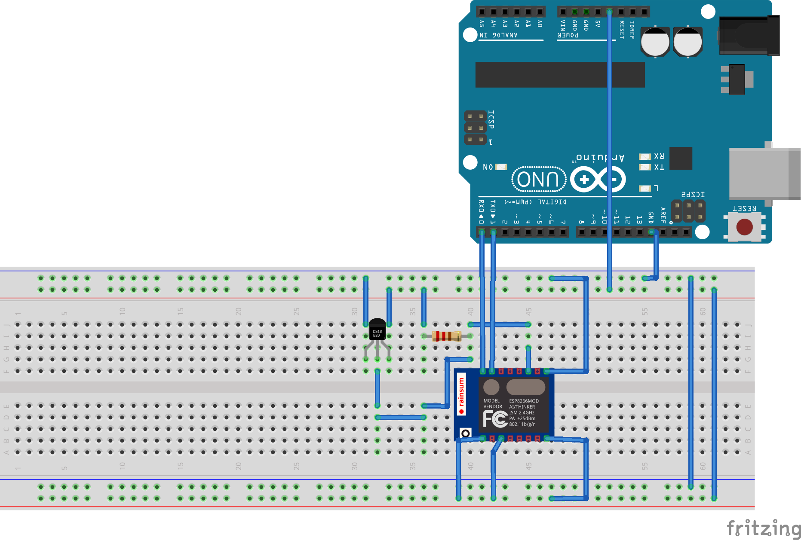

# ESP 8266 Tempetature Sensor

## Setting Up   

### Wiring 



### Creating Project 

```bash 
$ pio init --board=esp01 
``` 

### Installing Libraries and Deps 
 
```bash 
$ pio lib install  "OneWire" "Base64" "AfricasTalkingCloud" "DallasTemperature"
``` 
 
## Building  
 
```bash 
$ pio run 
``` 

## Uploading 

```bash 
$ pio run --target upload 
```  
